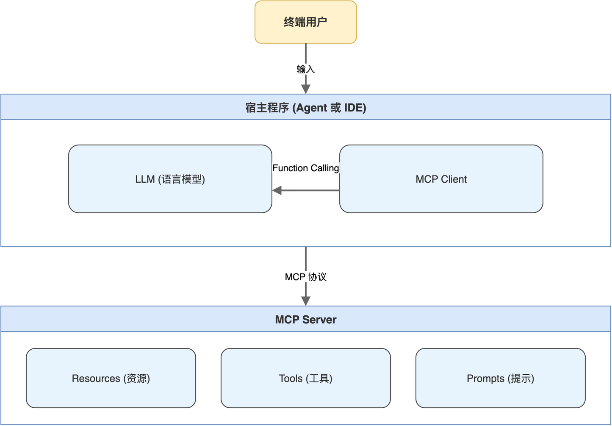

# 第01章 MCP协议的定位与价值

<!-- status: writing -->

在 AI 应用开发中,语言模型本身只能处理文本,要让模型查询数据库、读取文件、调用外部接口,必须借助某种工具协议将能力暴露给模型。过去几年,各类 Agent 框架与 IDE 助手各自定义了一套工具调用规范,导致同一个功能往往需要为不同生态分别封装,集成成本随接入对象数量线性上升。

Model Context Protocol(模型上下文协议,MCP)的出现意在解决这种生态割裂。它将 AI 应用与外部能力之间的连接方式标准化,把工具发现、调用、上下文传递等环节固化为统一协议;一个符合 MCP 规范的 Server,理论上可以被任意 MCP Client 接入。

读完本章,读者将厘清三件事:MCP 协议的诞生背景与定位、MCP 与 Function Calling 在分层上的差异、MCP 协议要解决的核心工程问题。本章不涉及代码实现,是后续章节实战的概念基础。

## 1.1 协议的由来与诞生背景

要理解 MCP 为何出现,需要先回看 AI 工具调用生态的演进轨迹。

最早期的 LLM 应用,模型只与用户对话,所有外部能力都嵌入在应用代码中。当应用需要让模型获取当前时间或查询某条订单时,常见做法有两种:一是直接把数据写入提示词;二是通过 ReAct(Reasoning + Acting,推理与执行)等推理框架,让模型输出文本指令,再由应用层解析指令并执行。这种做法的局限在于,工具能力没有结构化定义,模型输出格式难以约束,应用层需要写大量解析与容错逻辑。

随着 Function Calling(函数调用)能力被各家模型厂商陆续支持,情况有所改善。开发者可以在请求中显式声明若干函数的名称、参数与类型,模型在推理时会输出结构化的调用请求,应用层接到请求后执行函数,再把结果回填给模型。这一步把工具能力从自由文本提升为有 schema 约束的结构化对象,大幅降低了解析负担。

然而 Function Calling 只是模型层面的能力,它解决的是模型如何决定调什么,并不约束工具本身如何被组织、发现与部署。这意味着每个 Agent 框架、每个 IDE 助手仍需要自己实现一套工具注册、调用、结果回传的运行时;同一个数据库查询工具,接入 A 平台需要写一套适配,接入 B 平台又得写一套。工具复用基本无从谈起。

MCP 协议在 2024 年底以开放标准的形式发布,定位是 AI 应用与外部能力之间的标准化连接协议。可以把它类比为 USB-C 接口:USB-C 标准统一之前,各类设备的接口五花八门,需要大量转接线;USB-C 出现后,符合标准的设备之间即可直接互连。MCP 在 AI 工具生态扮演相似的角色,只要 Server 与 Client 各自符合协议,接入工作就退化为配置文件层面的事,不再涉及代码层面的协议适配。

笔者最初接触 MCP 时,关注点放在它的具体接口上,直到把多种工具调用方式横向比较一遍后才意识到,这一协议的真正价值是收敛了过去碎片化的接入方式。MCP 在设计上有三个明显特征。第一,它是开放协议,规范、SDK、参考实现均在 GitHub 公开维护,任何厂商都可以实现 Server 或 Client。第二,它采用 JSON-RPC 2.0 作为消息骨架,在传输层支持 stdio 与 HTTP/SSE 两种模式,既能覆盖本地工具的子进程通信场景,也能覆盖远程服务的网络部署场景。第三,它没有限定语言,目前已有 Python、TypeScript、Go、Rust 等多种语言的 SDK。本书使用的 FastMCP 即是 Python 生态下的 MCP Server 框架。

## 1.2 MCP与Function Calling的关系

Function Calling 与 MCP 经常被并列提及,但二者并不在同一层次,容易混淆。下面把它们各自的职责划清。

### 1.2.1 Function Calling是模型层能力

Function Calling 是模型推理阶段的一种输出形态。在一次对话请求中,调用方把若干函数的 schema 一并发给模型,模型根据用户意图判断是否需要调用某个函数,如需调用则输出符合 schema 的结构化参数。Function Calling 解决的是模型层面的决策问题:在自然语言意图与可执行函数之间建立映射。

Function Calling 本身不关心这些函数从哪里来、如何注册、调用结果如何回传。这些都由应用层自行处理。

### 1.2.2 MCP是协议层标准

MCP 关心的是另一组问题:工具、资源、提示等能力如何被组织成 Server,Client 如何发现这些 Server 暴露的能力清单,调用请求与响应如何在 Client 与 Server 之间交换。换言之,MCP 解决的是宿主程序如何找到工具、怎么把调用结果送回模型这一系列工程问题。

两者关系可以一句话概括:Function Calling 决定模型要调什么,MCP 决定宿主程序怎么把工具组织起来送给模型,以及怎么把结果送回模型。在实际 Agent 系统中,二者经常配合使用,MCP Server 暴露工具清单,Client 把清单转译为 Function Calling 的 schema 喂给模型,模型输出调用意图后,Client 再通过 MCP 调用对应 Server,把结果回填到下一轮对话。完整的 Agent 调用链如图 1-1 所示,包含五个角色:终端用户、宿主程序(Agent 或 IDE)、模型、MCP Client、MCP Server。其中 Client 与 Server 之间走 MCP 协议,宿主与模型之间走 Function Calling 协议;两条链路在 Client 中汇合,Client 既是 MCP 的发起方,也是模型上下文的组织方。

> 注意:Function Calling 与 MCP 分属不同分层。前者是模型层能力(决定调什么函数),后者是协议层标准(规定 Client 与 Server 之间如何交换工具清单与调用结果)。混淆二者会在排错时找错方向。

## 1.3 MCP在Agent生态中要解决的问题

把视角拉回工程实践,MCP 协议要解决的核心问题可以归纳为三类:工具碎片化、部署模式单一、上下文交互能力薄弱。

### 1.3.1 工具碎片化

在 MCP 出现之前,主流 Agent 框架与 IDE 助手都有自己的工具协议。一家厂商定义的 Tool 接口与另一家未必兼容,有些工具甚至深度耦合在框架内部,无法独立运行。对于工具开发者而言,要么选择只服务一个生态,要么为每个生态各写一遍适配层;对于 AI 应用集成者而言,接入第三方工具往往要从零评估其接口语义、错误码、参数序列化方式。

MCP 用 `tools/list`、`tools/call` 等标准方法,把工具发现与调用收敛到统一接口。同一个 MCP Server,符合协议的任意 Client 都能接入,工具开发者的目标受众从单一生态扩大到整个 MCP 生态。

### 1.3.2 部署模式单一

工具能力的部署方式过去存在两个极端。一端是嵌入式,工具作为函数直接写在 Agent 代码中,启动时一并加载,无法独立运行,也难以跨进程复用。另一端是完全独立的 HTTP 服务,工具被实现为标准 Web API,可以远程调用,但缺少工具发现层面的约定,调用方必须事先知道有哪些工具、各自的 schema 是什么。

MCP 把传输层做成了双形态:stdio 模式适合工具与 Client 同机运行的场景,Client 拉起 Server 子进程,通过标准输入输出交换消息;HTTP/SSE 模式适合远程部署、多客户端共享的场景。两种模式的应用层协议完全一致,Server 实现可以同时支持二者,部署形态由运行参数决定。

### 1.3.3 上下文交互能力薄弱

早期工具协议大多只覆盖调用语义,告诉 Client 有什么函数、把参数传过去、拿结果回来。但实际 Agent 系统的需求远不止此。例如,IDE 类应用希望用户能主动选择当前要让 AI 看哪些文件;一个数据分析 Agent 希望预置若干常用分析模板,用户输入斜杠命令即可触发。这两类需求都不属于调用范畴。

MCP 把这类需求拆出来作为独立能力维度,形成 Resources(资源)、Tools(工具)、Prompts(提示)三种能力。Resources 解决用户主动选数据的场景,Tools 解决模型自动调函数的场景,Prompts 解决用户触发预置模板的场景。这三个概念会在下一章详细展开。

MCP 协议的价值不在于发明任何全新机制,而在于把已经被各家分别实现过的能力,以开放标准的方式收敛在同一份规范下。对于工具开发者,它降低了适配成本;对于 Agent 集成者,它扩大了可接入的工具池;对于整个生态,它为后续更复杂的上下文协议演进留出了空间。下一章将进入 MCP 的概念核心,逐一解析 Resources、Tools、Prompts 的具体形态。
