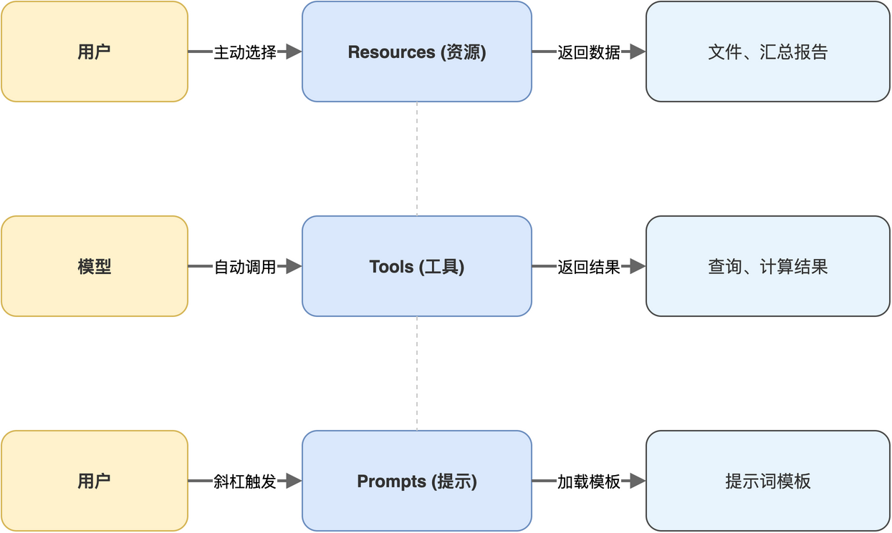

# 第02章 三大核心概念:Resources、Tools、Prompts

> 作者：**光谷老亢**　|　源码地址：[https://github.com/kang-airtc/mcp-mini-book](https://github.com/kang-airtc/mcp-mini-book)

<!-- status: writing -->

上一章把 MCP 协议的定位与诞生背景讲清楚之后,本章进入它的能力模型。一个 MCP Server 究竟能“暴露什么”给 Client?这正是 MCP 与早期工具协议拉开差距的地方。

MCP 把 AI 应用与外部能力之间的交互切分为三个正交维度:Resources(资源)、Tools(工具)、Prompts(提示)。三者的语义边界、触发方、生命周期都不一样,把它们混淆是初学者最常见的认知偏差。

读完本章,读者将能用一句话说清三者各自的职责,并能在工单分析这一贯穿案例中找到它们的对应实例。

## 2.1 Resources:面向AI的上下文数据

Resources 在 MCP 中代表上下文数据,可以是一个文件、一段数据库记录、一个 API 的响应,或一份动态生成的报告。Resources 由 Server 声明,但触发权在用户或 Client 一端,模型本身并不会主动去读 Resource。

Resource 通过统一资源标识符(Uniform Resource Identifier,URI)标识。URI 的 scheme 部分由 Server 自定义,常见的有 `file://`、`https://`,本书示例则使用业务化的 `tickets://`。Client 通过 `resources/list` 拉取可用 URI 清单,再通过 `resources/read` 拿到具体内容。下面是 `tickets://list` 资源的最小声明形态:

```json
{
  "uri": "tickets://list",
  "name": "工单列表",
  "mimeType": "application/json"
}
```

声明中三个字段各司其职:`uri` 是访问入口,`name` 是给用户看的展示名,`mimeType` 告知 Client 如何渲染内容。Resource 的实际读取通过另一个请求完成,Client 发送的报文骨架如下:

```json
{
  "method": "resources/read",
  "params": { "uri": "tickets://list" }
}
```

Server 接到 `resources/read` 后,返回对应 URI 的数据正文。Resource 的核心特征是被动:Server 只声明“我有哪些数据可被读取”,至于何时读取、是否读取,由用户决定。这一语义和 IDE 类应用中“用户主动选择当前要让 AI 看的文件”这一场景天然契合。

## 2.2 Tools:可被AI自动调用的功能

Tools 是 MCP 三大能力中最常用的一个,对应可被模型自动调用的函数。Server 通过 `tools/list` 暴露工具清单(含名称、描述、参数 schema),Client 把这份清单转译为 Function Calling 的 schema 喂给模型;模型在推理时决定调用哪个工具、传什么参数;Client 收到调用意图后,通过 `tools/call` 把请求转发给 Server,拿到结果再回填到模型的下一轮上下文。

Tool 有两个结构性特征。其一,输入是结构化的,由 JSON Schema 约束参数类型与必填项。其二,输出也是结构化的,Server 返回的 `content` 字段是数组,每个元素可以是文本块、图像块、嵌入的资源块等多种类型。下面是一个 Tool 的声明示例:

```json
{
  "name": "query_tickets_by_status",
  "description": "按状态查询工单",
  "inputSchema": {
    "type": "object",
    "properties": {
      "status": {
        "type": "string",
        "description": "工单状态:open、in_progress、resolved、closed"
      }
    },
    "required": ["status"]
  }
}
```

`description` 是给模型看的,模型在决定是否调用某个 Tool 时,主要依靠这段自然语言描述。`inputSchema` 是给模型与 Client 共用的契约,Client 在转发 `tools/call` 之前会按 schema 校验参数。当模型生成调用意图后,Client 发出的请求形如下:

```json
{
  "method": "tools/call",
  "params": {
    "name": "query_tickets_by_status",
    "arguments": { "status": "in_progress" }
  }
}
```

Tool 的设计哲学是“动作”,它接收参数、执行副作用或返回计算结果。与 Resource 的“被动数据”相对,Tool 是 MCP 中唯一让模型主动操控外部世界的入口。

## 2.3 Prompts:用户触发的提示模板

Prompts 是 MCP 三大能力中最容易被忽视的一个。它既不是模型自动调用的工具,也不是用户挑选的数据,而是预置的提示词模板,通常在 IDE 中以斜杠命令的形式呈现,例如 `/code_review`、`/explain`、`/analyze_priority`。

Prompt 由 Server 提供,但触发权在用户。当用户输入斜杠命令后,Client 通过 `prompts/get` 从 Server 拉取该模板的完整内容,再把它注入到当前对话流,模型据此执行后续推理,这一过程往往会进一步触发 Tool 调用。Prompt 本身只是一段精心设计的提示词,真正的执行交由模型与 Tools 完成。下面是一个 Prompt 的声明示例:

```json
{
  "name": "analyze_priority_tickets",
  "description": "分析所有高优先级工单",
  "arguments": []
}
```

Prompt 的价值不在于“做了什么”,而在于把领域专家的提示词工程经验沉淀下来。工单分析中的“高优先级工单排查”、“客户满意度归因”等场景,往往需要一段精心设计的多步指令才能引导模型按业务逻辑思考;把这些指令封装为 Prompt 放进 MCP Server,等于把提示词资产也工具化、可复用。一个团队如果有 30 名工程师都在使用同一个 MCP Server,就意味着这些提示词只需写一次,人人受益。

> 注意:同一份数据既可以做成 Tool(由模型主动调用),也可以做成 Resource(由用户主动附加到上下文)。两种实现的 SQL 与业务逻辑可以完全一样,差别只在装饰器与触发权归属。把高频拉取的列表做成 Resource,把动作类操作做成 Tool,是常见的设计取舍。

## 2.4 三者的协作关系与典型工作流

把三者放在同一张图上,各自的归属、触发方、传输方向就清晰了,如图 2-1 所示。三者由 Server 单向暴露给 Client,但触发方不同:Resources 由用户挑选、Tools 由模型决定、Prompts 由用户激活。



将这一职责差异整理成速查表,便于读者在写代码前对照确认,如表 2-1 所示。

**表 2-1 三大核心概念速查表**

| 维度 | Resources | Tools | Prompts |
|------|-----------|-------|---------|
| 触发方 | 用户主动选择 | 模型自动调用 | 用户主动触发 |
| 携带内容 | 数据本身 | 函数及调用结果 | 提示词模板 |
| 典型场景 | 文件列表、汇总报告 | 查询、计算、写入 | 斜杠命令 |
| Server 接口 | `resources/list`、`resources/read` | `tools/list`、`tools/call` | `prompts/list`、`prompts/get` |

以本书贯穿的工单分析场景为例,一次端到端的工作流可以拆成五步:第一步,用户在 IDE 中输入 `/analyze_priority` 激活高优先级分析 Prompt;第二步,Client 从 MCP Server 拉取该 Prompt 模板并注入对话上下文;第三步,模型读取模板后判断需要先看统计数据,自动调用 `get_ticket_statistics` Tool;第四步,Server 返回统计结果,模型继续推理,可能再调用 `query_tickets_by_status` 拿到处理中的高优先级工单;第五步,若需要更完整的背景,用户可以主动把 `tickets://report` 资源附进上下文。

三者在这次流程中各自扮演不同角色:Prompts 起到“工作流入口”的作用,Tools 承载“动作”,Resources 提供“补充上下文”。它们不是替代关系,而是组合关系,一个成熟的 MCP Server 通常会同时实现这三种能力,共同构成 Server 的能力面。

下一章进入更底层的视角,讨论这些 `tools/call`、`resources/read`、`prompts/get` 究竟以什么样的报文格式在 Client 与 Server 之间传递,以及 MCP 在传输层做了哪些不同选择。
