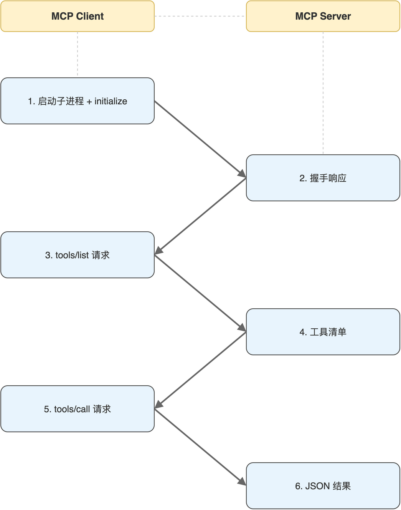

# 第03章 传输层:stdio、HTTP/SSE与JSON-RPC

> 作者：**光谷老亢**　|　源码地址：[https://github.com/kang-airtc/mcp-mini-book](https://github.com/kang-airtc/mcp-mini-book)

<!-- status: writing -->

上一章讲清了 MCP 暴露什么,本章讨论它怎么传送。Resources、Tools、Prompts 三类能力的调用请求与响应,究竟以什么样的报文格式在 Client 与 Server 之间流动?

MCP 在协议层选用 JSON-RPC 2.0 作消息骨架,在传输层提供 stdio 与 HTTP/SSE 两种通道。这一分层是 MCP 灵活性的根源,同一份 Server 实现,既可以作为本机子进程运行,也可以作为远程网络服务部署,业务代码完全不动。

读完本章,读者将能看懂 JSON-RPC 报文骨架、理解 stdio 与 HTTP/SSE 各自的进程模型,并能在工程场景中判断该选哪一种传输方式。

## 3.1 协议骨架:JSON-RPC 2.0

JSON-RPC 是基于 JSON 的远程过程调用(Remote Procedure Call,RPC)协议,2010 年发布的 2.0 版本是当前的主流版本。MCP 选用 JSON-RPC 2.0 作消息骨架,而非 REST 或 gRPC,主要基于四点考虑:双向、对等、批量、简单。其中“双向”尤为关键,MCP 中 Server 也会主动给 Client 发送通知(如能力变更、进度更新),这是单向 REST 模型难以原生表达的。

JSON-RPC 2.0 定义了三类消息:请求(Request)、响应(Response)、通知(Notification)。下面是一条 `tools/list` 请求的最简骨架:

```json
{
  "jsonrpc": "2.0",
  "id": 1,
  "method": "tools/list",
  "params": {}
}
```

请求消息包含四个字段。`jsonrpc` 固定为协议版本号 `"2.0"`;`id` 用于响应配对,Client 自行选择递增整数或字符串;`method` 指定要调用的方法;`params` 携带参数。MCP 把所有能力都映射成 method 名称,常见的有 `tools/list`、`tools/call`、`resources/read`、`prompts/get` 等。Server 收到请求后返回响应消息,通过相同的 `id` 与请求一一配对:

```json
{
  "jsonrpc": "2.0",
  "id": 1,
  "result": {
    "tools": [
      {
        "name": "query_tickets_by_status",
        "description": "按状态查询工单",
        "inputSchema": { "type": "object", "properties": {} }
      }
    ]
  }
}
```

成功响应使用 `result` 字段携带方法返回值;若出错,字段换成 `error`,内含 `code`、`message`、`data` 三部分。通知消息与请求消息结构几乎一致,差别是不带 `id`,也不期待响应。MCP 用通知机制传递服务端能力变更、长任务进度更新等单向信息。

## 3.2 stdio传输:基于子进程的本地通信

stdio 模式下,Client 通过操作系统的进程创建机制拉起 Server 作为自己的子进程,父子进程之间用 stdin 与 stdout 管道交换 JSON-RPC 报文。每条报文是一个完整的 JSON 对象,以换行符分隔。进程通信时序如图 3-1 所示,Client 主导生命周期,握手完成后双方通过两条管道做请求-响应往返。



stdio 模式的优势是简单:不需要端口分配、不需要鉴权、Server 生命周期自动跟随 Client(Client 退出时子进程一并终止)。代价是单进程对单进程的耦合,同一个 Server 不能被多个 Client 共享,N 个 Client 接入同一份代码会拉起 N 个独立的 Server 进程。

这一模型特别契合“工具是个本地命令行程序”的语义。Client 在配置文件中声明 `command` 与 `args`,启动时 fork 出 Server 进程,会话结束时整条管道关闭。FastMCP 框架对这一过程做了封装,Server 端写完业务后只需 `mcp.run()` 即可启动 stdio 监听,Client 端用 `stdio_client` 上下文管理器即可建立会话。具体代码细节在第 04 章与第 08 章展开。

## 3.3 HTTP/SSE传输:面向网络服务的双向流

HTTP/SSE 模式把 MCP Server 部署为长驻网络服务,通过 HTTP 端点对外暴露。MCP 规范较新版本将这一传输统一命名为 streamable-http,具体表现为:Client 通过 HTTP POST 发送请求报文,Server 通过 Server-Sent Events(服务器推送事件,SSE)维持一条长连接,把通知与流式响应主动推送给 Client。普通的请求-响应仍走 POST,只是响应消息有可能延后通过 SSE 流回。

双向流的关键在于 SSE 长连接:Client 与 Server 完成会话握手后,Server 可以在任意时刻通过 SSE 推送消息。这一能力对长耗时任务(如数据分析、向量嵌入)尤其重要,Server 可以在执行过程中持续推送进度通知,Client 不必同步阻塞等待。

HTTP/SSE 天然支持多 Client 共享同一个 Server 实例。每个 Client 在 Server 端注册独立的会话状态,但底层进程共用;这一点对部署成本、冷启动延迟与状态一致性都有显著影响。代价是要面对 HTTP 服务的常规问题:端口管理、跨域、鉴权、TLS 等等。本书示例工程把这些细节交给 FastMCP 内置的 streamable-http 传输处理,底层依赖 Starlette 与 Uvicorn,业务代码不感知。

> 注意:`streamable-http` 是 MCP 协议较新版本中合并的传输形态。早期 MCP SDK 中分别存在 `http` 与 `sse` 两种独立传输,新版本中已合并为 `streamable-http`,通过同一个 URL 端点同时承载 POST 请求与 SSE 流。读者在阅读其他资料时如遇旧命名,可视作等价。

## 3.4 两种传输模式的工程取舍

stdio 与 HTTP/SSE 并不互斥,而是覆盖不同部署场景。把它们的关键差异整理到一张表里,如表 3-1 所示。

**表 3-1 stdio 与 HTTP/SSE 工程特性对比**

| 维度 | stdio | HTTP/SSE |
|------|-------|----------|
| 进程模型 | Client 拉起 Server 子进程 | Server 独立长驻 |
| 鉴权机制 | 不需要 | 通常需要(API Key、JWT 等) |
| 多客户端 | 不支持(N 个 Client 各起一个 Server) | 支持 |
| 网络要求 | 无 | 需要可达端口 |
| 调试方式 | 查看子进程日志 | 查看服务日志、HTTP 抓包 |
| 适用场景 | 本机工具、CLI 集成 | 远程部署、团队共享 |

工程选型可以遵循一条简单规则:本机工具优先 stdio,远程工具或团队共享工具池选 HTTP/SSE。本机工具(数据库查询、本地文件读写、命令行包装)的天然属性就是与 Client 同机运行,stdio 模式零配置、零鉴权、随用随起。一旦工具需要远程访问、跨主机调用,或者一个团队的多名工程师要共享同一个工具池(如内部数据查询服务),HTTP/SSE 就成为必然选择。

两种模式的 Tool、Resource、Prompt 实现代码完全一致,迁移成本只体现在最终的传输层注册,FastMCP 用 `mcp.run()` 启动 stdio,用 `mcp.run(transport="streamable-http", port=8000, path="/mcp")` 启动 HTTP/SSE。这一便利是 FastMCP 相对手写 JSON-RPC 的核心价值。

本章把 MCP 在协议层与传输层的设计交代清楚。从下一章开始进入实战准备,从空白工程出发,把 Python 虚拟环境、FastMCP 依赖、项目目录约定逐一落地。
