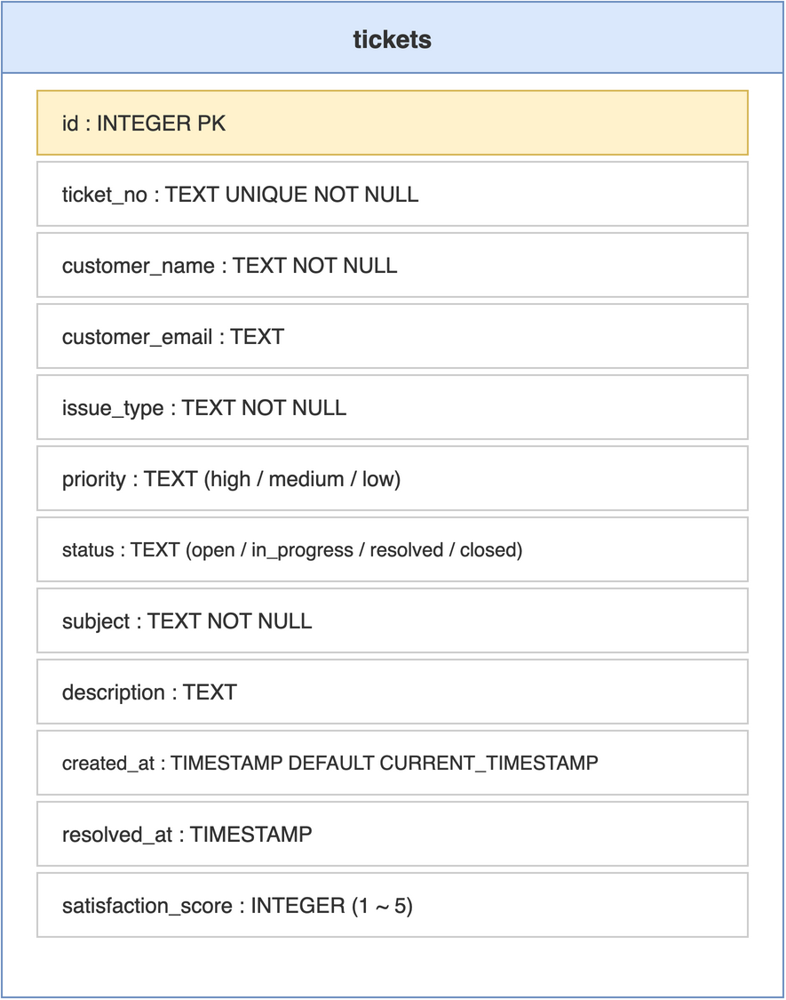

# 第05章 数据层设计:SQLite工单库

<!-- status: writing -->

上一章把工程骨架搭起来,本章给骨架填数据。MCP Server 本质上是个“把外部数据变成模型可读形态”的中间层,所以一切 Tool 与 Resource 的实现都要先回答一个前置问题:数据从哪里来?

本书示例选用 SQLite 作为数据存储。这是个嵌入式关系型数据库,以单文件形态存在、零配置、零进程,Python 标准库直接内置 `sqlite3` 模块,不必额外安装数据库服务。这一选择纯粹基于教学便利;生产环境中只需把驱动替换为 PostgreSQL、MySQL 等的客户端,Tool/Resource 的实现框架保持不变。

读完本章,读者将理解工单表的 schema 设计、字段语义、样例数据的设计意图,以及 `init_database` 初始化函数的可重入逻辑。

## 5.1 业务场景:电商工单分析

本书示例的业务场景是电商客服工单的数据分析。选这个场景出于三点考虑。其一,工单具备结构化、维度丰富、状态机简单的特点,适合演示 Tool 的查询、统计、分析三类典型形态。其二,业务语义清晰,读者不需要任何额外领域知识也能理解。其三,数据量小但维度齐全,刚好能在一张表里展示出 MCP Server 在 Agent 工作流中的真实价值。

电商工单的典型生命周期是:客户提交工单 → 系统按优先级分发 → 客服处理 → 用户确认满意度 → 关单。Agent 在这个场景下的价值在于宏观分析,某天的高优先级工单是否暴涨、物流类问题占比是否异常、哪类问题的平均解决时间最长。这些问题往往需要跨多个 Tool 串联回答,正是 MCP 工作流的典型用例。

笔者最早尝试为 Agent 设计示例场景时,曾考虑过天气查询、文件搜索等更通用的例子,但这些场景的 Tool 之间缺乏数据上的内在关联,难以串成有意义的工作流。工单分析则不同:一个“高优先级工单分析”任务自然会拉起统计、查询、详情读取三类 Tool,链路清晰,正适合演示 Resources、Tools、Prompts 三者的协作。

## 5.2 表结构与字段语义

示例库只设计一张表 `tickets`,字段精挑细选,刚好覆盖后续所有 Tool 与 Resource 的查询需求。单表结构的好处是 SQL 简单,读者把注意力放在 MCP 协议本身,而不是 ORM 或多表 JOIN 的细节。

```sql
CREATE TABLE IF NOT EXISTS tickets (
    id                  INTEGER PRIMARY KEY AUTOINCREMENT,
    ticket_no           TEXT UNIQUE NOT NULL,
    customer_name       TEXT NOT NULL,
    customer_email      TEXT,
    issue_type          TEXT NOT NULL,
    priority            TEXT NOT NULL,
    status              TEXT NOT NULL,
    subject             TEXT NOT NULL,
    description         TEXT,
    created_at          TIMESTAMP DEFAULT CURRENT_TIMESTAMP,
    resolved_at         TIMESTAMP,
    satisfaction_score  INTEGER
);
```

表中字段大致可分为四类。第一类是主键与对外标识:`id` 是内部自增主键,`ticket_no` 是对外公开的工单编号(如 `TK2024001`),供客户与客服在沟通中引用。第二类是客户信息:`customer_name` 与 `customer_email`,前者必填、后者可空。第三类是工单分类维度:`issue_type` 取业务定义的中文类目(退款申请、物流查询等),`priority` 取 `high/medium/low`,`status` 取 `open/in_progress/resolved/closed`,这三个字段是后续多个 Tool 的核心切片维度。第四类是内容与时间字段:`subject` 是工单主题、`description` 是详细描述、`created_at` 自动取当前时间、`resolved_at` 在状态转为 resolved 时被填充、`satisfaction_score` 取 1 到 5 表示客户满意度评分。

整张表的可视化呈现见图 5-1。虽然结构上只有单表、没有外键,但 `priority` 与 `status` 两个枚举字段构成了隐式状态机,后续多个 Tool 都基于这两个字段做切片聚合;`resolved_at` 与 `satisfaction_score` 则是解决时间分析与满意度分析的数据基础。



字段约束方面有一处细节值得提:`ticket_no` 上的 `UNIQUE` 约束承担了去重的工程职责,防止同一工单被重复录入。生产场景中通常还需要对 `created_at`、`status` 加索引以加速分析查询,本书示例数据量小,索引设计略去。

> 注意:`priority` 与 `status` 在 schema 层使用 TEXT 而非枚举类型,这是 SQLite 的实际局限(不支持原生 ENUM)。生产中切到 PostgreSQL 等数据库后,应改用 CHECK 约束或 ENUM 类型强约束取值范围,防止业务层写入未授权的状态值。

## 5.3 样例数据与初始化函数

示例工程内置 10 条样例工单,经过精心设计而非随机填充。10 条数据要覆盖三类需求:有的工单 status 为 `resolved` 且带满意度评分,用于解决时间分析与满意度分析;有的工单 status 为 `open`,用于演示待处理列表查询;有的工单 priority 为 `high` 且 status 为 `in_progress`,作为高优先级排查 Prompt 的产出对象。10 条数据如此设计后,后续所有 Tool 调用都能返回非空、有业务含义的结果。

初始化逻辑封装在 `init_database` 函数中,核心是两步:建表与按需插入样例数据。先看建表部分:

```python
import sqlite3
from pathlib import Path

DB_PATH = Path("tickets.db")


def init_database():
    """初始化数据库并创建示例数据"""
    conn = sqlite3.connect(DB_PATH)
    cursor = conn.cursor()

    cursor.execute("""
        CREATE TABLE IF NOT EXISTS tickets (
            id INTEGER PRIMARY KEY AUTOINCREMENT,
            ticket_no TEXT UNIQUE NOT NULL,
            customer_name TEXT NOT NULL,
            ...
        )
    """)
```

`CREATE TABLE IF NOT EXISTS` 是 SQLite 的幂等建表语法,如果表已存在则不报错。这使得 `init_database` 可以被反复调用而不破坏既有数据,对学习场景非常友好。建表完成后,接着是按需插入样例数据:

```python
    cursor.execute("SELECT COUNT(*) FROM tickets")
    if cursor.fetchone()[0] == 0:
        sample_data = [
            ("TK2024001", "张三", "zhangsan@email.com",
             "退款申请", "high", "resolved",
             "订单未收到货要求退款", "客户在3天前下单但物流显示异常",
             "2024-01-15 09:30:00", "2024-01-15 14:20:00", 5),
            # 其余 9 条略,完整内容见 agent-mcp-demo/mcp_server.py
        ]
        cursor.executemany(
            "INSERT INTO tickets (...) VALUES (?, ?, ?, ?, ?, ?, ?, ?, ?, ?, ?)",
            sample_data,
        )
        conn.commit()

    conn.close()
```

`SELECT COUNT(*)` 的判空检查是关键,只有在表为空时才插入样例,这样反复运行 `python3 mcp_server.py` 不会让样例数据线性膨胀。`executemany` 批量插入比循环单条 `execute` 高效得多;参数化占位符 `?` 同时也起到防 SQL 注入的作用,这在生产场景中尤其重要。

`init_database` 在 Server 的 `__main__` 入口被调用,确保每次启动都先确认数据完整,再进入 `mcp.run()` 监听:

```python
if __name__ == "__main__":
    init_database()
    mcp.run()
```

数据层就绪后,下一步是把上层 MCP 能力接到数据上。下一章把 5 个 Tool 的实现逐一展开,介绍 `@mcp.tool()` 装饰器的签名约定、参数 schema 的推导规则,以及面向工单数据的 SQL 写法。
