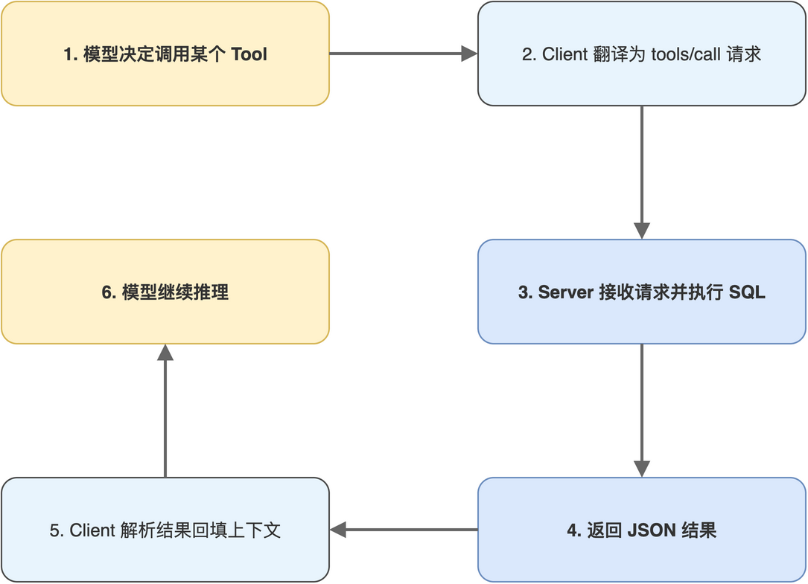

# 第06章 Tool能力实现

> 作者：**光谷老亢**　|　源码地址：[https://github.com/kang-airtc/mcp-mini-book](https://github.com/kang-airtc/mcp-mini-book)

<!-- status: writing -->

数据层就绪后,本章把 5 个 Tool 的实现逐一接到 SQLite 工单库上。Tool 是 MCP 三大能力中最常用的一个,也是模型与外部世界发生交互的核心入口。

5 个 Tool 涵盖三类典型用法:聚合统计(`get_ticket_statistics`)、单条详情(`get_ticket_detail`)、列表查询(`query_tickets_by_status`、`query_tickets_by_type`)、轻量分析(`analyze_resolution_time`)。三类用法在 SQL 写法、参数 schema、返回结构上各有差异,逐一展开后,读者将对 MCP Tool 的实现范式有完整认识。

读完本章,读者将理解 `@mcp.tool()` 装饰器的工作机制、参数 schema 的推导规则,以及 5 个 Tool 各自的 SQL 实现要点。

## 6.1 Tool装饰器与签名约定

`@mcp.tool()` 装饰器把普通 Python 函数提升为 MCP Tool。它做的事可以拆成三步:解析函数签名推导 `inputSchema`、抽取 docstring 作为 description、把函数注册到 FastMCP 内部的工具表。最小调用形态如下:

```python
@mcp.tool()
def query_tickets_by_status(status: str) -> str:
    """按状态查询工单

    Args:
        status: 工单状态(open、in_progress、resolved、closed)

    Returns:
        JSON 格式的工单列表
    """
    ...  # 业务实现
```

框架从这个声明中提取三件事。第一,Tool 名取自函数名,即 `query_tickets_by_status`,这一名字会出现在 `tools/list` 返回的清单中。第二,description 取 docstring,完整传递给 Client,再被转译为 Function Calling 的描述字段,直接影响模型的调用决策。第三,`inputSchema` 由参数类型注解推导,`status: str` 推导出 `{"type": "string"}`,无默认值的参数被归入 required 列表;Args 块中的参数描述会被并入 schema 的 `description` 字段,作为模型决策时的辅助信息。

返回值约定为字符串,内容通常是 JSON 序列化后的业务数据。Server 端把它包装为 content 数组中的 text 块返回给 Client;Client 拿到后通过 `json.loads` 还原。这一约定看似多走一步,实际上是为了在协议层保持简洁,所有 Tool 返回值都是 text 块,模型只需要解一种格式。

完整的 Tool 调用链路如图 6-1 所示,从用户提问出发,经模型决策、Client 转发、Server 执行、结果回填,最终回到模型的下一轮推理。这条链路在任何 MCP 项目中都是统一的,Tool 的实现者只关心其中“Server 执行 SQL”这一环节。



> 注意:docstring 是给模型看的,不是给读者看的。模型在决定是否调用某个 Tool 时,主要依据 description 的自然语言描述。如果 docstring 写得含糊,模型会出现“知道有这个 Tool 但不知该不该调”的状态,产生跳过或乱用的副作用。Args 块的参数描述应显式列出枚举取值范围,避免模型生成不合法参数。

本章实现的 5 个 Tool 涵盖统计、详情、查询、分析四种用途,完整清单见表 6-1。

**表 6-1 工单分析服务的 5 个 Tool**

| 类别 | Tool 名 | 参数 | 返回 | 用途 |
|------|---------|------|------|------|
| 统计 | `get_ticket_statistics` | 无 | JSON 统计概览 | 提供按状态/类型/优先级的分布数据 |
| 详情 | `get_ticket_detail` | `ticket_no: str` | JSON 单条详情 | 按工单号查具体工单 |
| 查询 | `query_tickets_by_status` | `status: str` | JSON 列表 | 按状态筛选工单 |
| 查询 | `query_tickets_by_type` | `issue_type: str` | JSON 列表 | 按问题类型筛选工单 |
| 分析 | `analyze_resolution_time` | 无 | JSON 时长统计 | 计算解决时间的均值与极值 |

## 6.2 统计与详情类Tool

`get_ticket_statistics` 是 5 个 Tool 中最重的一个,但它对模型最友好,一次调用即可拿到工单池的全貌(总数、各状态分布、各类型分布、各优先级分布、平均满意度),省去模型多次串联调用的成本。先看函数前半段的查询部分:

```python
@mcp.tool()
def get_ticket_statistics() -> str:
    """获取工单统计概览"""
    conn = sqlite3.connect(DB_PATH)
    cursor = conn.cursor()

    cursor.execute("SELECT status, COUNT(*) FROM tickets GROUP BY status")
    status_stats = {row[0]: row[1] for row in cursor.fetchall()}
```

第一段聚合按 `status` 分组计数,得到 `{"open": 2, "in_progress": 3, ...}` 这样的字典结构。同样的模式接下来分别用于 `issue_type` 与 `priority` 维度,最后把所有结果组装成一个 JSON:

```python
    cursor.execute("SELECT issue_type, COUNT(*) FROM tickets GROUP BY issue_type")
    type_stats = {row[0]: row[1] for row in cursor.fetchall()}

    cursor.execute("SELECT priority, COUNT(*) FROM tickets GROUP BY priority")
    priority_stats = {row[0]: row[1] for row in cursor.fetchall()}

    conn.close()

    stats = {
        "总计工单数": sum(status_stats.values()),
        "按状态分布": status_stats,
        "按类型分布": type_stats,
        "按优先级分布": priority_stats,
    }
    return json.dumps(stats, ensure_ascii=False, indent=2)
```

关键设计有两点。其一,把多个独立维度的统计合到一次 Tool 调用中,模型一次拿到完整画像;若每个维度都独立成 Tool,模型为了组装总图会发起多轮调用,token 消耗成倍增加。其二,`json.dumps` 显式传入 `ensure_ascii=False` 保留中文,避免模型在后续推理中被 `\uXXXX` 转义序列干扰判断。

`get_ticket_detail` 通过 `ticket_no` 查询单条工单的完整字段,代码极简:

```python
@mcp.tool()
def get_ticket_detail(ticket_no: str) -> str:
    """获取单个工单的详细信息"""
    conn = sqlite3.connect(DB_PATH)
    conn.row_factory = sqlite3.Row
    cursor = conn.cursor()

    cursor.execute("SELECT * FROM tickets WHERE ticket_no = ?", (ticket_no,))
    row = cursor.fetchone()
    conn.close()

    if row:
        return json.dumps(dict(row), ensure_ascii=False, indent=2)
    return json.dumps({"error": f"未找到工单 {ticket_no}"}, ensure_ascii=False)
```

两个细节值得注意。其一,使用参数化占位符 `?` 防 SQL 注入;`ticket_no` 来自模型生成的参数,理论上不可信,必须走 prepared statement。其二,设置 `conn.row_factory = sqlite3.Row` 后,`fetchone()` 返回的 row 支持按列名访问,`dict(row)` 可直接转为带列名的字典,不必手工对照列序;查询不到时返回带 `error` 字段的 JSON,而非空对象,这样模型在拿到结果后能区分“查到但字段全空”与“压根没查到”两种语义。

## 6.3 查询类Tool

`query_tickets_by_status` 与 `query_tickets_by_type` 在结构上是对称的:同样按某一维度筛选、同样返回 JSON 列表、同样按 `created_at` 倒序。把两者并列展示,有助于读者识别 MCP Tool 在“列表查询”这一典型场景下的固定范式。先看 `query_tickets_by_status` 的签名与连接部分:

```python
@mcp.tool()
def query_tickets_by_status(status: str) -> str:
    """按状态查询工单

    Args:
        status: 工单状态(open、in_progress、resolved、closed)
    """
    conn = sqlite3.connect(DB_PATH)
    conn.row_factory = sqlite3.Row
    cursor = conn.cursor()
```

docstring 中 `status` 参数的取值列举写得很具体。这一信息会被 FastMCP 提取后透传给模型,模型在生成调用参数时会优先采用列表内的取值。如果省略这部分描述,模型可能传入“待处理”等中文取值,导致查询返回空。接下来是查询与返回部分:

```python
    cursor.execute("""
        SELECT ticket_no, customer_name, issue_type, priority, status, subject, created_at
        FROM tickets WHERE status = ?
        ORDER BY created_at DESC
    """, (status,))

    rows = cursor.fetchall()
    tickets = [dict(row) for row in rows]
    conn.close()

    return json.dumps(tickets, ensure_ascii=False, indent=2)
```

SELECT 子句没有用 `SELECT *`,而是显式列出 7 个字段。这是有意为之:列表场景通常不需要 `description` 这类大文本字段,显式列名既能减少传输体积,也避免把模型上下文塞满低密度信息。`query_tickets_by_type` 的实现完全同构,只把 `WHERE status = ?` 换成 `WHERE issue_type = ?`、把参数描述换成问题类型枚举,代码在此略去,完整版本见仓库 `agent-mcp-demo/mcp_server.py`。

## 6.4 分析类Tool:解决时间分布

`analyze_resolution_time` 演示了 Tool 能做的不止“查询”,还能承担轻量分析任务。它统计已解决工单的解决时长分布,返回平均、最大、最小三个指标。SQL 部分用 SQLite 内置的 `julianday` 函数把时间戳转换为天数:

```python
@mcp.tool()
def analyze_resolution_time() -> str:
    """分析工单解决时间(仅统计已解决的工单)"""
    conn = sqlite3.connect(DB_PATH)
    cursor = conn.cursor()

    cursor.execute("""
        SELECT
            AVG(julianday(resolved_at) - julianday(created_at)) AS avg_days,
            MAX(julianday(resolved_at) - julianday(created_at)) AS max_days,
            MIN(julianday(resolved_at) - julianday(created_at)) AS min_days,
            COUNT(*) AS resolved_count
        FROM tickets
        WHERE resolved_at IS NOT NULL
    """)
```

两个工程要点值得记下。其一,在 SQL 层面通过 `WHERE resolved_at IS NOT NULL` 过滤未解决工单,而非把整表拉到 Python 端再过滤,这一写法对数据量增大后的扩展性至关重要。其二,`julianday` 把时间戳转换为儒略日数(天为单位),做差后乘以 24 即可得到小时数,绕过了 Python 端复杂的日期解析。接下来是结果组装与容错处理:

```python
    row = cursor.fetchone()
    conn.close()

    if row and row[3] > 0:
        analysis = {
            "已解决工单数": row[3],
            "平均解决时间": f"{row[0] * 24:.1f} 小时",
            "最长解决时间": f"{row[1] * 24:.1f} 小时",
            "最短解决时间": f"{row[2] * 24:.1f} 小时",
        }
    else:
        analysis = {"message": "暂无已解决的工单数据"}

    return json.dumps(analysis, ensure_ascii=False, indent=2)
```

代码有显式的容错分支:`row[3]`(即 `resolved_count`)大于 0 时返回统计结果,否则返回“暂无数据”提示。这种“业务上的空结果”应当作为正常返回值,而非异常向上抛,这一点对 MCP Tool 尤其重要。异常会被框架包装成 error 响应,模型在拿到 error 后可能误以为是技术故障而中止推理;而显式的 `message` 字段则能让模型理解“业务结果为空”并切换分析路径。

5 个 Tool 实现完成后,Server 已具备核心动作能力。下一章把剩余的 2 个 Resource 与 2 个 Prompt 接上,完成 Server 的全部能力面。
