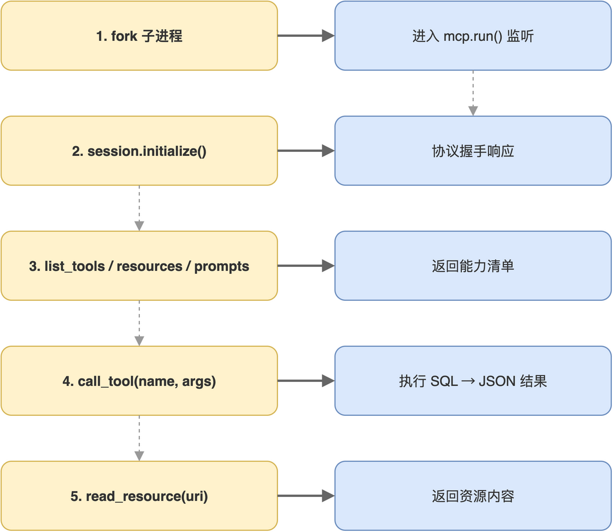

# 第08章 stdio客户端实战

> 作者：**光谷老亢**　|　源码地址：[https://github.com/kang-airtc/mcp-mini-book](https://github.com/kang-airtc/mcp-mini-book)

<!-- status: writing -->

Server 端能力齐全后,本章把 Client 端实现接上,完成最小可运行的端到端链路。一个 MCP Server 即使写得再完整,没有 Client 来调用,所有能力都还停留在“声明”层面;唯有 Client 把这些能力调起来,链路才算闭环。

本书使用 MCP Python SDK 实现 Client,基于 `asyncio` 异步模型。Client 的代码相比 Server 更短、模式也更固定,本质上就是“建立连接、列能力、调能力”三步,而后所有工程化考虑(超时、重试、错误处理)都在这个基础上扩展。

读完本章,读者将能独立写一段 Client 代码连入任意 MCP Server,完成能力探查、Tool 调用、Resource 读取。

## 8.1 Client的生命周期与会话初始化

MCP Client 是宿主程序中实际与 Server 对话的组件。它负责四件事:拉起 Server 子进程(stdio 模式)或建立网络连接(HTTP 模式)、完成协议握手、缓存 Server 暴露的能力清单、把模型生成的调用意图翻译成 MCP 请求。前两件事在会话初始化阶段一次性完成,后两件事贯穿整个会话周期。

MCP Python SDK 的 Client API 是 async 接口,需要在 `asyncio` 事件循环中运行。这是有意为之,一次 Tool 调用可能耗时数百毫秒到数秒,异步模型能避免阻塞宿主程序的主循环。Client 入口的基本结构如下:

```python
import asyncio
import json
from mcp import ClientSession, StdioServerParameters
from mcp.client.stdio import stdio_client


async def run_client():
    """运行 MCP Client 示例"""
    server_params = StdioServerParameters(
        command="python3", args=["mcp_server.py"], env=None
    )
```

`StdioServerParameters` 描述如何拉起 Server 子进程:`command` 是可执行程序、`args` 是命令行参数、`env` 可注入环境变量。本例直接用 `python3` 启动 `mcp_server.py`;在真实 Agent 宿主中,这些参数会被写在配置文件里(第 10 章会讨论 OpenCode 的 `opencode.json` 写法)。

接下来用两层 `async with` 上下文管理建立会话,完成协议握手:

```python
    async with stdio_client(server_params) as (read, write):
        async with ClientSession(read, write) as session:
            await session.initialize()
            print("✅ 连接成功!")
            # 在此可调用 session 的各种方法
```

`stdio_client` 上下文管理器内部完成两件事:fork 子进程、建立 stdin/stdout 管道并返回 read/write 句柄。`ClientSession` 在 read/write 之上封装出会话语义,`session.initialize()` 触发 MCP 协议握手,Client 与 Server 互相协商版本号与能力,确认通讯就绪。退出 `with` 时上下文管理器自动关闭管道、回收子进程,资源清理交给 Python 运行时即可,业务代码不必手动收尾。

## 8.2 列出能力清单

握手成功后,通常先查询 Server 的能力清单。MCP 提供三个 list 接口分别对应三类能力,代码如下:

```python
            tools = await session.list_tools()
            for tool in tools.tools:
                print(f"  • {tool.name}: {tool.description}")

            resources = await session.list_resources()
            for resource in resources.resources:
                print(f"  • {resource.uri}: {resource.name}")

            prompts = await session.list_prompts()
            for prompt in prompts.prompts:
                print(f"  • {prompt.name}: {prompt.description}")
```

三种 list 接口的结构对称:返回值是带 `.tools` / `.resources` / `.prompts` 字段的对象,字段值是列表。每个元素携带 `name`、`description`、`uri`(Resource 专属)等元信息。这一阶段对宿主程序至关重要,它把 Server 暴露的能力组装成可视化界面或 Function Calling schema,作为后续调用的依据。

在生产宿主中,list 调用通常发生在会话初始化阶段并被缓存。模型在每轮推理前从缓存读取能力清单,生成调用指令;Client 拿到指令后再触发具体的 `call_tool` / `read_resource`。本书示例为了演示完整流程,在每次脚本运行中都做一次 list,实际工程化部署应避免重复拉取。

## 8.3 调用Tool与读取Resource

`session.call_tool(name, arguments)` 用于触发 Tool 调用,`session.read_resource(uri)` 用于读取 Resource。两者的返回结构都包含 content 数组,数组中每个元素是不同 MIME 类型的内容块。先看调用无参 Tool `get_ticket_statistics` 的代码:

```python
            result = await session.call_tool("get_ticket_statistics", {})
            for content in result.content:
                if content.type == "text":
                    stats = json.loads(content.text)
                    print(json.dumps(stats, ensure_ascii=False, indent=2))
```

`arguments` 用空字典传递,因为该 Tool 不接受参数。遍历 `result.content` 时检查 `type` 字段,只处理 text 块即可(图像、嵌入资源等类型在本示例不涉及)。`content.text` 是 Tool 返回的字符串,本例 Server 返回的是 JSON,Client 再 `json.loads` 还原为字典即可消费。带参数的 Tool 调用只需把 `arguments` 改为带键值的字典:

```python
            result = await session.call_tool(
                "query_tickets_by_status", {"status": "in_progress"}
            )
```

字典的 key 必须与 Tool 的 `inputSchema` 中声明的字段名完全一致,前者由 docstring 中的 `Args` 块决定,后者由 FastMCP 自动推导。schema 校验由 Server 端进行,若参数缺失或类型不符,Server 会返回 error 响应,这一异常在 Client 端表现为 `result.isError` 字段为 `True`。Resource 的读取语义类似,只是参数从 Tool 名换成 URI:

```python
            resource = await session.read_resource("tickets://list")
            if resource.contents:
                content = resource.contents[0]
                if hasattr(content, "text"):
                    tickets = json.loads(content.text)
                    # 后续处理 tickets ...
```

这里有个易错点:Resource 返回字段是 `contents`(复数)而非 `content`,允许 Server 把一个 URI 拆成多个内容块返回(例如分页输出、多段文本拼接)。本例只取第一个内容块,并通过 `hasattr` 容错处理非 text 类型的情况。Prompt 的读取与 Tool 类似,通过 `session.get_prompt(name, arguments)` 获取模板,返回值是 `messages` 列表,每个元素带 `role` 与 `content` 字段。

## 8.4 完整链路联调

把握手、能力发现、Tool 调用、Resource 读取四个阶段串起来,就构成了一次完整的 stdio 链路联调,如图 8-1 所示。整条链路在父子进程之间通过两条管道双向交换 JSON-RPC 报文,Client 完全主导节奏,Server 被动响应。



联调的启动方式极简,在 `mcp_client.py` 所在目录执行:

```bash
python3 mcp_client.py
```

Client 启动后会自动 fork `mcp_server.py` 子进程,不必手动启动 Server。完成所有调用后 Client 退出,子进程一并终止。这种“自包含”的运行方式正是 stdio 模式的核心便利。

> 注意:stdio 模式下 Server 进程的 stdout 被协议占用,Server 端的 `print` 会自动改走 stderr。如果在 Server 里 `print` 调试信息发现 Client 端看不到,不是 print 没执行,而是它进了 stderr 流。宿主程序(如 OpenCode)通常会把子进程 stderr 转到自己的日志面板。

联调过程中常遇到三类问题。第一类是 Server 启动失败:Client 看到的是连接异常,实际原因往往是 `mcp_server.py` 里的导入错误或语法错误,需要先单独运行 `python3 mcp_server.py` 看 stderr 日志。第二类是 Tool 调用参数错误:Server 返回 error 响应,常见原因是 schema 不匹配,把 Tool 的 description 与 Args 写细致(例如显式列举枚举取值)可以显著降低这类错误。第三类是长任务超时:默认会话有超时限制,长任务建议拆分成多次小调用,或者切换到 HTTP/SSE 模式,利用 SSE 推送进度避免被超时强制中断。

stdio 链路联调成功后,本书示例的最小闭环已经形成。接下来两章把它扩展为更工业化的形态:下一章把 stdio 改造成 HTTP/SSE 模式,支持多客户端与远程部署;再下一章把整套服务接入真实的 Agent 宿主 OpenCode,并讨论生产场景中的调试方法。
