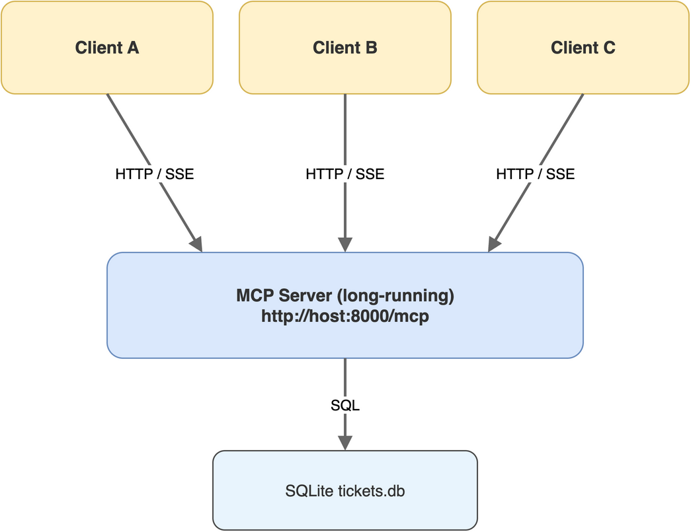

# 第09章 HTTP/SSE模式改造与多客户端

> 作者：**光谷老亢**　|　源码地址：[https://github.com/kang-airtc/mcp-mini-book](https://github.com/kang-airtc/mcp-mini-book)

<!-- status: writing -->

上一章把 stdio 模式的端到端链路跑通,但 stdio 的边界也很明显,单机、单 Client、随 Client 启停。本章把 Server 改造为 HTTP/SSE 模式,解锁多 Client 共享与远程部署。

迁移的关键发现是:业务代码几乎不需要改动。Tool、Resource、Prompt 的实现完全复用,差别只在 `mcp.run()` 的传输参数上。这一便利是 FastMCP 在框架层做的工作,也是 MCP 协议“传输与业务解耦”设计哲学的直接体现。

读完本章,读者将理解 streamable-http 传输的内部结构、SSE 长连接的双向消息流,并能写出连接 HTTP MCP Server 的 Python Client 代码。

## 9.1 stdio到HTTP/SSE的迁移动机

stdio 模式好用,但有三个场景下它不够用。其一,工具需要远程访问,例如数据库查询工具部署在内网服务器上,IDE 运行在工程师本机,stdio 模式无法跨网络。其二,多 Client 共享同一份工具,例如一个团队的 30 名工程师都要接入公司内部的工单分析服务,stdio 模式下 N 个 Client 会拉起 N 个独立 Server 进程,资源浪费且数据一致性难保证。其三,工具承担长耗时任务并需要持续推送进度,stdio 虽然技术上能传通知,但默认会话超时机制不友好。

HTTP/SSE 模式把这三类问题一并解决。Server 解耦为独立长驻服务,通过 HTTP 端点对外暴露;多 Client 可以并发连接同一个 Server 实例,共享内存、连接池、缓存等资源;SSE(Server-Sent Events,服务器推送事件)提供 Server 向 Client 主动推送消息的能力,与 MCP 的通知语义天然契合。

笔者在初次做这种迁移时,曾担心两个版本会维护成“一份代码两个分叉”,最后必有一方落后。实际操作下来发现,只要把业务函数从入口文件抽出来集中放在一处(本书示例是 `mcp_server.py` 的中段),两个入口文件(`mcp_server.py` 与 `mcp_server_http.py`)各自只保留五六行启动代码,维护成本几乎为零。

## 9.2 基于FastMCP的HTTP传输实现

新建 `mcp_server_http.py`,把 `mcp_server.py` 中的所有 `@mcp.tool()`、`@mcp.resource()`、`@mcp.prompt()` 函数原样拷贝,只改最后的入口部分:

```python
# mcp_server.py (stdio)
if __name__ == "__main__":
    init_database()
    mcp.run()

# mcp_server_http.py (HTTP/SSE)
if __name__ == "__main__":
    init_database()
    mcp.run(transport="streamable-http", port=8000, path="/mcp")
```

`mcp.run()` 内部根据 `transport` 参数选择启动路径。`transport="streamable-http"` 触发 FastMCP 内置的 HTTP 传输实现,底层使用 Starlette 框架处理路由、Uvicorn 作为 ASGI 服务器。`port=8000` 指定监听端口,`path="/mcp"` 指定 MCP 端点的 URL 路径,最终 Server 在 `http://localhost:8000/mcp` 上对外暴露统一端点。

传输栈的分层结构如图 9-1 所示。最顶层是业务函数(Tool、Resource、Prompt),FastMCP 框架在中间负责 MCP 协议编解码与会话管理,Starlette 提供 HTTP 路由与 SSE 流支持,Uvicorn 处于最底层处理网络 I/O。这种分层意味着每一层都可以独立替换:把 Starlette 换成其他 ASGI 框架不需要改业务代码,把 Uvicorn 换成 Hypercorn 等替代品同样不影响上层。



streamable-http 是 MCP 协议较新版本中合并的传输形态。同一个 `/mcp` 端点同时支持两种 HTTP 方法:POST 用于发送 JSON-RPC 请求、GET 用于建立 SSE 长连接。这种合并简化了 Client 的连接管理,只需指向一个 URL,SDK 内部会自动协调两类请求。

## 9.3 SSE端点的双向消息流

Server-Sent Events 是 W3C 定义的 HTTP 流式推送协议,本质是一个保持不关闭的 HTTP GET 请求,Server 持续向 Client 写入事件数据。事件格式很简单,每个事件由 `event:`、`data:`、`id:` 等字段组成,以两个换行符分隔。SSE 与 WebSocket 的核心差异在于:SSE 是单向的(Server 推、Client 收),WebSocket 是双向的;SSE 走标准 HTTP,与反向代理、防火墙、HTTP/2 都兼容,而 WebSocket 需要协议升级。

MCP 在 streamable-http 模式下用两套 HTTP 连接合成双向能力:Client 到 Server 走 POST 携带 JSON-RPC 请求,Server 到 Client 走 SSE 流推送响应、通知与进度更新。一次 `tools/call` 的完整流程如下:第一步,Client 通过 POST 发送 JSON-RPC 请求,带唯一 `id`;第二步,Server 接收后开始执行 Tool;第三步,执行过程中,Server 可选地通过已建立的 SSE 流推送进度通知(多次推送);第四步,Server 通过 SSE 流推送最终响应,带与请求相同的 `id` 用于配对。

多客户端共享同一个 Server 实例时,Server 端通过 session-id 区分不同 Client。每个 session 维护独立的 SSE 流,推送时按 session-id 路由。这一切都由 FastMCP 在框架层封装,业务函数无感知,同一个 `query_tickets_by_status` 函数可以被 N 个 Client 并发调用,FastMCP 通过异步任务与连接池实现隔离,避免不同 Client 的数据互相串扰。

> 注意:HTTP/SSE 模式下业务函数虽然能并发执行,但若 Tool 内部对全局状态(如模块级变量、文件锁、单例对象)有依赖,仍可能产生 Client 间的相互影响。生产部署中应避免在 Tool 实现里写 `global` 变量,数据库连接应在每个函数内独立打开关闭,而不是共享全局连接池。

## 9.4 HTTP Client的长连接处理

HTTP Client 与 stdio Client 的代码差异只在连接建立部分。建立连接后的 `list_tools`、`call_tool`、`read_resource` 三类调用,接口与返回结构完全一致,这一对称性保证了业务调用代码可以在两种传输之间无缝切换。先看连接建立:

```python
import asyncio
import json
from mcp import ClientSession
from mcp.client.streamable_http import streamable_http_client


async def run_http_client():
    """运行 HTTP MCP Client 示例"""
    async with streamable_http_client(url="http://localhost:8000/mcp") as (
        read,
        write,
        _session_id_callback,
    ):
        async with ClientSession(read, write) as session:
            await session.initialize()
            print("✅ HTTP 连接成功!")
```

`streamable_http_client` 的返回值是三元组,前两个 `read` 与 `write` 与 `stdio_client` 一致,第三个 `_session_id_callback` 是一个回调函数,用于获取当前会话的 session-id。session-id 是 Server 端用于路由 SSE 流的关键标识,Client 在需要主动断开重连时可以基于它恢复会话。本书示例不做断线重连,故用下画线前缀的变量名表明该回调不会被使用。

握手完成后,调用代码与 stdio 版本一模一样:

```python
            result = await session.call_tool(
                "query_tickets_by_status", {"status": "open"}
            )
            for content in result.content:
                if content.type == "text":
                    tickets = json.loads(content.text)
                    print(f"找到 {len(tickets)} 个待处理工单")
```

正是这种业务调用代码不动、只改连接代码的迁移成本,让 HTTP/SSE 成为 stdio 的平滑升级路径。开发期使用 stdio 减少调试成本(改一行代码、立刻重启 Client、Server 跟着启停),生产部署切到 HTTP/SSE 享受远程访问与多客户端支持。

HTTP 模式联调需要先启动 Server、再启动 Client,分别使用两个终端:

```bash
# 终端 1
python3 mcp_server_http.py

# 终端 2
python3 mcp_client_http.py
```

Server 启动后会在控制台输出端点地址 `http://localhost:8000/mcp`,Client 直接连接该地址。比 stdio 模式多出来的“先启服务”这一步,意味着需要面对一系列网络层问题,端口被占用、防火墙拦截、跨主机网络不可达等。这些问题在 stdio 模式下不存在,在 HTTP/SSE 模式下成为常规调试任务,具体排查方法在下一章展开。

HTTP/SSE 改造完成后,Server 已具备真实生产环境部署的雏形。下一章把它接入 OpenCode 这一真实 Agent 宿主,让 5 个 Tool、2 个 Resource、2 个 Prompt 真正服务于 AI 工作流,并讨论从启动到协议层的常见排错方法。
