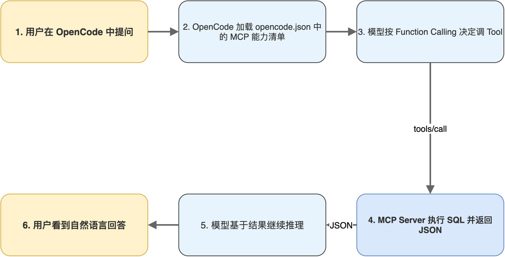

# 第10章 接入OpenCode与调试排错

<!-- status: writing -->

前九章把 MCP Server 与 Client 都跑通,但所有验证都通过命令行脚本完成,Server 暴露的能力还没有真正进入 AI 工作流。本章把整套服务接入 OpenCode 这一开源终端 AI 编程助手,让 Tool 与 Resource 在真实对话中被调用。

接入的核心动作只有一件事:写一份 `opencode.json` 配置。但围绕这件事会引出生产场景中常遇到的四类故障,启动失败、握手失败、调用失败、协议异常。本章把这些故障的现象、原因与排查路径整理成可对照的清单,作为读者后续部署 MCP 服务的参考。

读完本章,读者将能把自己的 MCP Server 配置进 OpenCode、识别生产环境中的常见故障模式,并掌握基本的排查方法。

## 10.1 opencode.json的MCP配置

OpenCode 是开源的终端 AI 编程助手,支持接入多种 LLM 提供商,并以 MCP 协议作为标准方式集成外部工具。它的 MCP 配置写在 `~/.config/opencode/opencode.json` 中,以 `mcp` 字段为根,其下可挂载多个 Server,每个 Server 用唯一名字标识:

```json
{
  "$schema": "https://opencode.ai/config.json",
  "mcp": {
    "tickets_server": {
      "type": "local",
      "command": [
        "python3",
        "<repo-path>/agent-mcp-demo/mcp_server.py"
      ],
      "enabled": true
    }
  }
}
```

配置中四个字段各司其职。`type` 取 `local` 表示走 stdio 模式,OpenCode 启动时会作为父进程拉起 Server 子进程;`command` 是启动命令的数组形式,首元素是可执行程序、后续是参数,数组形式相比单字符串可以避免空格转义问题;`enabled` 是开关,设为 `false` 可临时禁用而不必删除整段配置,开发期对照不同 Server 时这一字段非常有用。`<repo-path>` 是占位符,实际配置中应替换为本机绝对路径。

OpenCode 启动时读取 `opencode.json`,按配置启动并连接所有 enabled 的 Server,完成握手后把每个 Server 暴露的能力清单(`tools/list`、`resources/list`、`prompts/list`)合并到 LLM 的 Function Calling schema 中。用户在对话中提出的需求,OpenCode 会根据模型判断自动调用对应的 Tool 或附加 Resource。完整调用链如图 10-1 所示,从用户输入到 Tool 执行结果回填,涉及六个步骤,链路中任一环节失败都会以不同症状暴露。



配置文件支持同时挂载多个 Server,例如本机的工单分析 Server、本机的设计工具 Server、公司内部的代码搜索 Server,在同一份 `opencode.json` 里并列声明,OpenCode 启动时按 `enabled` 标志逐一启动并合并能力清单。模型在推理时无法感知这些能力来自哪个 Server,统一按 Function Calling 调度。

## 10.2 local与remote两种接入形态

`opencode.json` 中 `mcp.<name>.type` 字段有两种取值:`local` 与 `remote`,分别对应 stdio 与 HTTP/SSE 两种传输模式。上一节的示例使用 `local`,接下来是 `remote` 类型的配置形态:

```json
{
  "mcp": {
    "tickets_server_http": {
      "type": "remote",
      "url": "http://localhost:8000/mcp",
      "enabled": true
    }
  }
}
```

`remote` 类型用 `url` 字段指向 HTTP 端点。OpenCode 启动时不会拉起任何进程,直接尝试连接该 URL。这要求 Server 必须已经独立运行,若 Server 未启,OpenCode 在握手阶段就会报错。

选 `local` 还是 `remote`,本质是上一章 stdio 与 HTTP/SSE 选型的延续。`local` 适合工具在本机执行、依赖工程师本机环境(如本地数据库、本地文件系统)、希望 Server 跟随 OpenCode 启停的场景;`remote` 适合工具部署在远程服务器、团队共享同一个 Server 实例、Server 需要长期运行(例如承担定时任务或维持缓存)的场景。

两种类型可以混合使用。同一份 `opencode.json` 下,工程师本机的代码搜索工具走 `local`、公司内部的工单分析服务走 `remote`,二者在 OpenCode 对话中无感知地协作。模型不区分 Tool 来自哪种传输,统一按能力清单调用。

> 注意:`local` 模式下 `command` 字段中的 `python3` 默认指向系统 Python,不会自动激活 venv。如果项目依赖装在 venv 内,应改用 `venv/bin/python3` 的绝对路径,例如 `["<repo-path>/venv/bin/python3", "<repo-path>/mcp_server.py"]`,以避免出现“本机能跑、宿主报 ModuleNotFoundError”的典型故障。

## 10.3 启动与连接类故障排查

生产场景中的故障可以分为四类:启动失败、握手失败、调用失败、协议异常。把它们整理成可对照的清单,如表 10-1 所示。

**表 10-1 常见故障与排查路径**

| 类别 | 现象 | 可能原因 | 排查方法 |
|------|------|----------|----------|
| 启动失败 | OpenCode 提示 `server failed to start` | command 路径错误或脚本语法错 | 终端独立运行 `python3 <path>/mcp_server.py` 查 stderr |
| 启动失败 | 报 `ModuleNotFoundError` | 未使用 venv 内的 Python | 在 command 中改用 venv/bin/python3 的绝对路径 |
| 启动失败 | 端口被占用(HTTP 模式) | 8000 端口已被其他进程占用 | `lsof -i:8000` 查占用进程 |
| 握手失败 | `Connection refused` | Server 未启动或端口不对 | `curl http://localhost:8000/mcp` 测试连通性 |
| 握手失败 | `Protocol version mismatch` | Client/Server SDK 版本不一致 | 升级 fastmcp 与 mcp 包到一致版本 |
| 调用失败 | `Schema validation error` | Tool 参数类型或必填项错误 | 检查 Tool 的 docstring 与类型注解 |
| 调用失败 | Tool 返回 error | Tool 内部异常 | 在 Tool 函数中加 try/except 打印 traceback |
| 协议异常 | `JSON parse error` | 报文格式错误 | 启用 SDK 调试日志查看原始报文 |

启动失败的最常见原因是 Python 解释器路径错误。OpenCode 在 `type: local` 模式下使用 `command` 中指定的 Python;如果工程师在 venv 中开发,而 `command` 写的是 `python3`(指向系统默认 Python),会出现“本机直接 `python3 mcp_server.py` 跑得好好的,接入 OpenCode 后报 ImportError”这一典型现象。原因是 OpenCode 启动子进程时没有继承 venv 激活状态。解决办法是把 `command` 改成 `venv/bin/python3` 的绝对路径,确保依赖一致。

HTTP 模式的握手失败通常归因于端口或网络可达性。建议按三步排查:第一步,确认 Server 在监听,执行 `lsof -i:8000` 看是否有进程占用该端口,有则进一步确认是不是预期中的 `mcp_server_http.py`;第二步,确认 Client 与 Server 在同一网络可达,执行 `curl -v http://localhost:8000/mcp`,正常情况应返回 HTTP 状态码或 SSE 流头部,若返回 `Connection refused` 则说明根本没建立 TCP 连接;第三步,跨主机部署时检查防火墙规则与 SELinux/AppArmor 策略,这些往往是“本机能连、跨机连不上”的隐藏原因。

## 10.4 协议与业务类异常排查

调用失败的故障最频繁,但通常也最容易定位,Server 端有完整堆栈、Client 端有 error 响应。MCP 协议本身不规定异常处理范式,但生产实践中有一些值得遵循的约定。最重要的一条是:Tool 内部捕获异常、打印日志、向 Client 返回友好的 error message,而不是让异常透传到框架层。下面是推荐的错误处理范式:

```python
import traceback


@mcp.tool()
def get_ticket_detail(ticket_no: str) -> str:
    """获取单个工单的详细信息"""
    try:
        conn = sqlite3.connect(DB_PATH)
        cursor = conn.cursor()
        cursor.execute("SELECT * FROM tickets WHERE ticket_no = ?", (ticket_no,))
        row = cursor.fetchone()
        conn.close()
        if not row:
            return json.dumps({"error": f"未找到工单 {ticket_no}"}, ensure_ascii=False)
        return json.dumps(dict(row), ensure_ascii=False, indent=2)
    except Exception:
        traceback.print_exc()
        return json.dumps({"error": "内部错误,请联系管理员"}, ensure_ascii=False)
```

把 `traceback.print_exc()` 留在异常分支里,日志在 Server 端依然可见,便于排查;向 Client 返回的 error message 则保持简洁,不暴露内部栈信息。这样既保留排查依据,又避免敏感信息泄露给模型上下文。

返回值中显式区分业务结果(找不到工单)与技术异常(数据库连接失败)对模型行为有重要影响。前者是正常业务出口,模型会基于“没找到”这一信息继续推理,可能换个 `ticket_no` 重试或转而调用列表 Tool 查范围;后者通常表示工具暂时不可用,模型应选择跳过或重试。MCP 协议本身不强制约定这一区分,需要由 Tool 实现者主动维持,这是 MCP Server 开发中“易被忽视但影响巨大”的细节。

日志输出位置在两种传输模式下有差异。stdio 模式下,Server 的 `print` 输出会自动走到 stderr(stdout 被协议占用),OpenCode 会把 stderr 转发到自己的日志面板,排查时直接看 OpenCode 日志即可。HTTP/SSE 模式下,日志输出到 Server 进程所在终端,与 OpenCode 完全解耦,需要单独查看。生产场景应改用 Python 标准 `logging` 模块,按级别写入文件或集中收集到日志系统,避免 `print` 散落在代码各处难以排查。

本书走完了 MCP 协议从概念到落地的全部链路:第 01 章到第 03 章建立概念基础,第 04 章到第 07 章把 Server 实现接到数据上,第 08 章到第 09 章打通 Client 端与两种传输模式,第 10 章把整套服务接入真实 Agent 宿主。10 个章节用同一个工单分析示例贯穿始终,所有抽象都对应可运行的 Python 代码,完整源码见 `agent-mcp-demo/` 目录。

读者完成全书后,有三个推荐的下一步。其一,把示例中的 SQLite 替换为业务实际使用的数据库(PostgreSQL、MySQL 等),Tool 与 Resource 的实现框架保持不变,只换驱动与连接参数。其二,把 HTTP/SSE 版本的 Server 部署到内网服务器,在 `opencode.json` 中用 `type: remote` 接入,给整个团队共享。其三,把团队中已沉淀的提示词资产封装为 Prompt 模板放进 MCP Server,让 Agent 工作流从“个人工具”演化为“团队能力”,这一步往往是 MCP Server 在企业内部真正落地的临门一脚。
